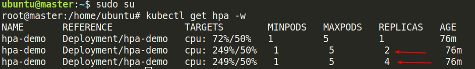

# Lab 02 – Horizontal Pod Autoscaler (HPA)

### Obiettivo
Imparare a scalare automaticamente i Pod in base all'utilizzo della CPU.

---
### Deployare Metrics Server

1) Installa il Metrics Server
```bash
kubectl apply -f https://github.com/kubernetes-sigs/metrics-server/releases/latest/download/components.yaml
```
2) Correggi la configurazione per ambienti locali
```bash
kubectl edit deployment metrics-server -n kube-system
```
3) Nella sezione `args` ci devono essere queste righe:
```bash
args:
      - --cert-dir=/tmp
      - --secure-port=4443
      - --kubelet-insecure-tls
      - --kubelet-preferred-address-types=InternalIP,Hostname,ExternalIP
```

4) Riavvia e verifica
```bash
kubectl rollout restart deployment metrics-server -n kube-system

kubectl get pods -n kube-system | grep metrics
```  

### Deploy dell'app CPU-intensive
```bash
kubectl apply -f deployment.yaml
kubectl apply -f service.yaml
```

### Creare HPA
```bash
kubectl autoscale deployment hpa-demo --cpu-percent=50 --min=1 --max=5
kubectl get hpa
```

### Generare carico
```bash
kubectl run -i --tty load-generator --image=busybox /bin/sh
while true; do wget -q -O- http://hpa-demo; done
```

### Osservare lo scaling
```bash
kubectl get hpa -w
kubectl get pods -w
```



