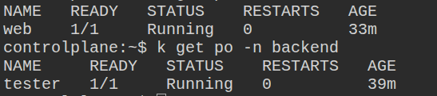

# Lab 03 – Network Policies

## Obiettivo
Creare due namespace isolati (`frontend` e `backend`), deployare due Pod (`web` e `tester`) e applicare una **NetworkPolicy** che permetta il traffico **solo all’interno del namespace `frontend`**, bloccando qualsiasi richiesta proveniente da namespace esterni.

---

## Creare Namespace
```bash
kubectl create ns frontned
kubectl create ns backend
```

## Deployare Pod e Service
```bash
# creare pod nginx nel namespace frontend
kubectl run web --image=nginx --restart=Never -n frontend

# crea service che espone `web` dentro al cluster
kubectl expose pod web -n frontend --port=80 --target-port=80

# creare pod busybox nel namespace backend
kubectl run tester --image=busybox --restart=Never -n backend -- sleep 7200
```

## Verifica che i pod siano in ready
```bash
kubectl get po -n frontend
kubectl get po -n backend
```


## Testare la connettività
```bash
kubectl exec -n backend tester -- wget -qO- http://web.frontend.svc.cluster.local
```

Output
```bash
<!DOCTYPE html>
<html>
<head><title>Welcome to nginx!</title></head>
<body>...</body>
</html>
```

## Applica la Network Policy
Creare una NetworkPolicy che permetta l’accesso al Pod `web` solo da altri Pod all’interno dello stesso namespace (`frontend`), bloccando tutto il traffico proveniente da namespace esterni (come `backend`).

```bash
# La NetworkPolicy seleziona i Pod tramite `labels`.
# Aggiungendo `app=web`, la policy saprà che deve applicarsi al Pod `web`
kubectl label pod web app=web -n frontend

kubectl apply -f deny-external.yaml
```

## Verifica la Connettività
```bash
# la connessione backend --> frontend deve fallire
kubectl exec -n backend tester -- wget -qO- --timeout=5 http://web.frontend.svc.cluster.local

# la connessione frontend --> frontend deve avere successo
kubectl run temp -i --image=busybox -n frontend -- sh
wget -O- http://web
```
