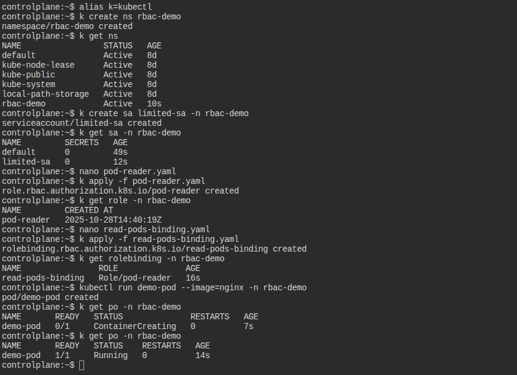
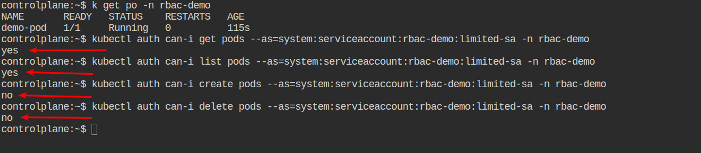

# RBAC in Kubernetes

In questo scenario ho imparato a:

- Creare un namespace dedicato `rbac-demo`
- Definire un ServiceAccount con privilegi limitati `limited-sa`
- Creare un Role con permessi specifici `pod-reader`
- Legarlo al ServiceAccount tramite un RoleBinding `read-pods-binding`
- Testare azioni consentite `get, list` e negate `create, delete`

---

## Step 1 - Crea il Namespace
```bash
kubectl create namespace rbac-demo

# Verifica la creazione del namespace
kubectl get ns
```

## Step 2 - Crea il ServiceAccount
Crea un ServiceAccount a cui verranno concesse autorizzazioni limitate:
```bash
kubectl create serviceaccount limited-sa -n rbac-demo

# Verifica la creazione del sa
kubectl get sa -n rbac-demo
```

## Step 3 - Crea il Role con Permessi Limitati
Crea un Role chiamato `pod-reader` nel namespace rbac-demo
che consenta solo le operazioni di lettura (get, list) sui Pod.

```bash
vi pod-reader.yaml

# Applica il Role
kubectl apply -f pod-reader.yaml

# Verifica la creazione
kubectl get role -n rbac-demo
```

## Step 4 - Crea un RoleBinding
Il **RoleBinding** serve per collegare il **Role** al **ServiceAccount**

```bash
# Crea il file `read-pods-binding.yaml`
vi read-pods-binding.yaml

# Applica il RoleBinding
kubectl apply -f read-pods-binding.yaml

# Verifica la creazione
kubectl get rolebinding -n rbac-demo
```

## Step 5 - Verifica azioni consentite
Verificare che il **ServiceAccount** `limited-sa` abbia effettivamente i permessi concessi dal **Role** `pod-reader`:
- può ottenere (get) i Pod
- può elencare (list) i Pod nel namespace `rbac-demo`

```bash
# Crea un pod di test
kubectl run demo-pod --image=nginx -n rbac-demo

# Verifica permesso `get`
kubectl auth can-i get pods --as=system:serviceaccount:rbac-demo:limited-sa -n rbac-demo

# Verifica permesso `list`
kubectl auth can-i list pods --as=system:serviceaccount:rbac-demo:limited-sa -n rbac-demo

# Output atteso per entrambe i comandi
yes
```
## Step 6 - Verifica azioni negate
Verificare che il **ServiceAccount** `limited-sa` **non** possa eseguire azioni non previste dal suo **Role** `pod-reader`.
In particolare, confermare che **non può creare né cancellare Pod**.

```bash
# Verifica se può creare pod
kubectl auth can-i create pods --as=system:serviceaccount:rbac-demo:limited-sa -n rbac-demo

# Verifica se puo cancellare pod
kubectl auth can-i delete pods --as=system:serviceaccount:rbac-demo:limited-sa -n rbac-demo

# Output atteso da entrambe i comandi
no
```


